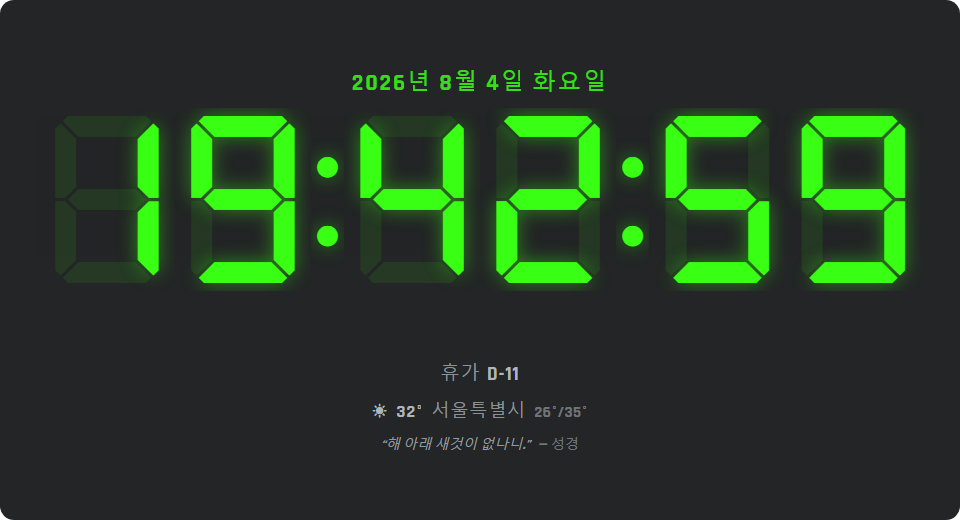
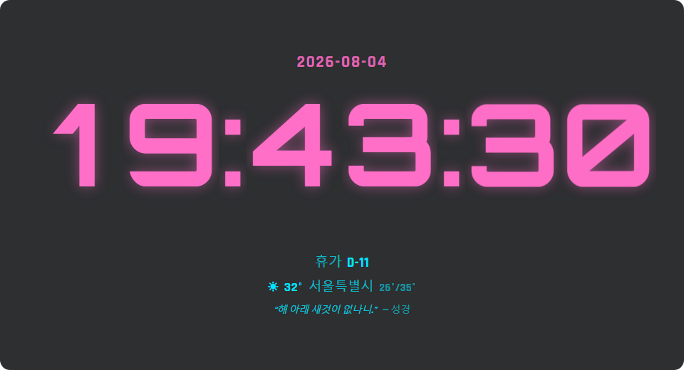
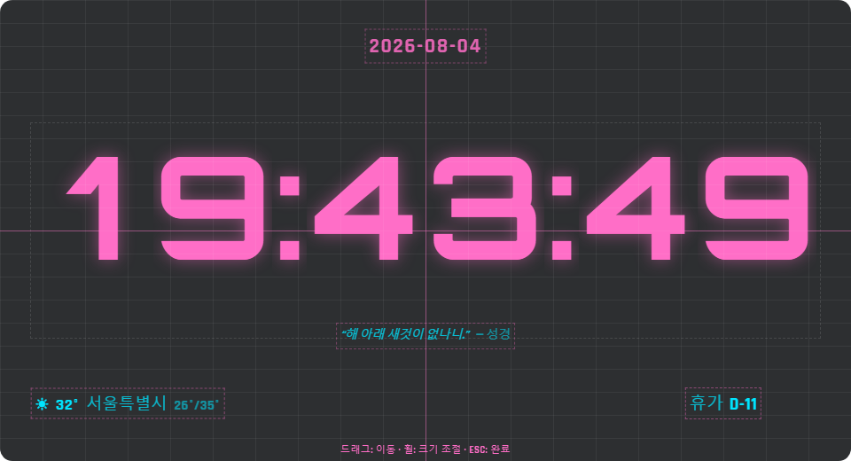
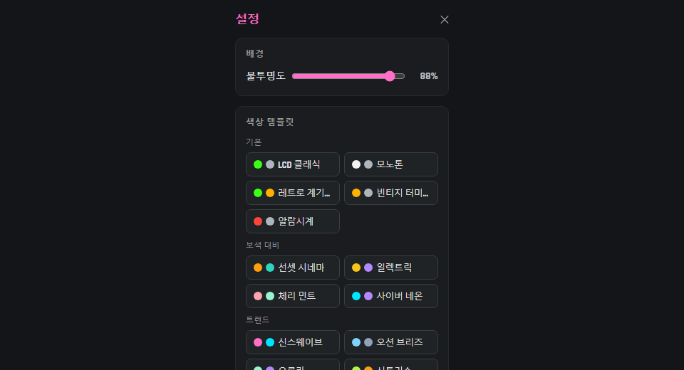

# winClock

Windows에 사용하기 위한 시계 위젯 — MDClock 스타일의 가볍고 예쁜 데스크톱 디지털 시계입니다.

[](https://github.com/hierru/winClock/releases)
[](LICENSE)

Tauri 2 + 순수 HTML/CSS/JS로 만들어져 실행 파일 약 10MB, 메모리 약 30~40MB로 가볍게 상시 실행할 수 있습니다.



## 주요 기능

| 색상 템플릿 · 항목별 색상 | 레이아웃 편집 모드 |
|---|---|
|  |  |

### 시계
- **반응형 스케일** — 창 크기를 조절하면 시계가 자동으로 맞춰집니다
- **숫자 전환 애니메이션** — 페이드 / 슬라이드 / 플립 (자리별 셀 단위)
- 12/24시간제, 초 표시, 콜론 깜박임, 시계 크기(30~100%)

### 폰트 · 색상
- **내장 폰트 8종** (7-Segment LCD, 14-Segment LCD, Orbitron 등) + **시스템 폰트 전체** 검색 선택
- **항목별 지정** — 시간 / 날짜 / D-Day / 날씨 / 일정 / 명언 각각 폰트·색상·크기를 따로 설정
- **16색 팔레트 + 색상 템플릿 14종** — 기본 / 보색 대비(선셋 시네마, 일렉트릭 등) / 트렌드(신스웨이브, 오로라 등) 원클릭 적용

### 레이아웃 편집
- 우클릭 > **⠿ 레이아웃 편집** — 각 항목을 드래그해 원하는 위치에 자유 배치 (시간은 고정 앵커)
- 5% 그리드 표시·스냅, 중앙선 강조, **휠로 항목 크기 조절**, 창 끝에서는 너비를 유지한 채 멈춤
- 배치는 창 크기 대비 비율로 저장되어 리사이즈에도 유지

### 정보 표시
- **날짜** — 한국어/ISO/영어/숫자만 등 10가지 형식
- **D-Day** — `D-30 / D-DAY / D+5` 카운트다운 (최대 3개)
- **날씨** — 도시 검색(한글 지명 완전 지원) 후 현재 날씨·기온·최저/최고 표시 (Open-Meteo, API 키 불필요, 30분 갱신)
- **Google 캘린더** — iCal 비공개 주소를 여러 개 등록하면 다가오는 일정 표시 (반복 일정 지원, 캘린더별 색 점)
- **오늘의 명언** — 내장 세계 명언 365선을 매일 자동 교체 (오프라인 동작)
- 모든 항목 보이기/숨기기 토글

### 창 · 시스템
- 프레임 없는 투명 창, **Ctrl + 드래그로 이동**(이동 모드 시각 표시), 가장자리·가이드 화살표로 크기 조절
- **별도 설정 창** — 항목별 카드로 정리된 설정, 변경 즉시 시계에 반영
- **시스템 트레이** — 클릭으로 숨기기/보이기, 트레이로 최소화
- Windows 시작 시 자동 실행, **창 위치·크기 기억**, 설정은 파일로 안전하게 저장



## 설치

[Releases](https://github.com/hierru/winClock/releases)에서 `winClock_x.x.x_x64-setup.exe`를 받아 실행하세요.
사용자 계정 단위 설치라 관리자 권한이 필요 없습니다. (요구 사항: Windows 10/11 x64 + WebView2 — Windows 11에는 기본 내장)

## Google 캘린더 연동 방법

1. [Google 캘린더](https://calendar.google.com) → ⚙ 설정 → 왼쪽 "내 캘린더의 설정"에서 캘린더 선택
2. **캘린더 통합** 섹션의 **"iCal 형식의 비공개 주소"** 복사 (`private-...`가 들어간 주소)
3. winClock 설정 ⚙ → Google 캘린더에 붙여넣고 **추가**

> 회사(Workspace) 계정은 관리자가 외부 공유를 제한한 경우 비공개 주소가 보이지 않을 수 있습니다.

## 개발

```bash
npm install
npm run dev        # Tauri 개발 모드
```

UI만 빠르게 확인하려면 `src/`를 아무 정적 서버로 서빙하면 됩니다 (Tauri 전용 기능은 브라우저에서 비활성화).

```bash
npm run build      # 릴리스 빌드: src-tauri/target/release/bundle/nsis/*.exe
```

### 구조

```
src/               프론트엔드 (index.html, styles.css, main.js, quotes.js, fonts/)
src-tauri/         Tauri 셸
  ├─ src/main.rs   Rust 명령: fetch_ics(캘린더), list_system_fonts, autostart, 설정 파일 저장
  ├─ tauri.conf.json
  └─ capabilities/ 창 권한
```

- 폰트는 npm 패키지(dseg, @fontsource/*)에서 `src/fonts/`로 복사해 번들합니다 (오프라인 동작)
- 캘린더 fetch는 WebView CORS 제한을 피하기 위해 Rust(reqwest)에서 수행합니다
- 설정은 `%APPDATA%\com.hierru.winclock\settings.json`에 저장됩니다

## 라이선스

[PolyForm Noncommercial 1.0.0](LICENSE) — **비상업적 용도로는 자유롭게** 사용·복사·수정·배포할 수 있으며, **상업적 사용만 제한**됩니다.

번들된 폰트는 각자의 라이선스(SIL Open Font License 등)를 따릅니다: [DSEG](https://github.com/keshikan/DSEG), Orbitron, Share Tech Mono, Bebas Neue, Rajdhani, Major Mono Display (Google Fonts/Fontsource).
날씨 데이터: [Open-Meteo](https://open-meteo.com/) (CC BY 4.0)
